# Road Trip for LibreNMS

> **Just for fun - version 0.2.0.** Developed and tested against LibreNMS 26.9.1 in Docker with demo data.

A [LibreNMS](https://www.librenms.org/) plugin that turns your network into a little world you can drive around in.
Your **custom maps are islands**, the **links on them are roads** with the live traffic of their ports driving on
them, and a map node that **links to another map is a bridge** across the sea to that island. Park in front of a
building and the device's LibreNMS page opens; park by a road and you get the port.

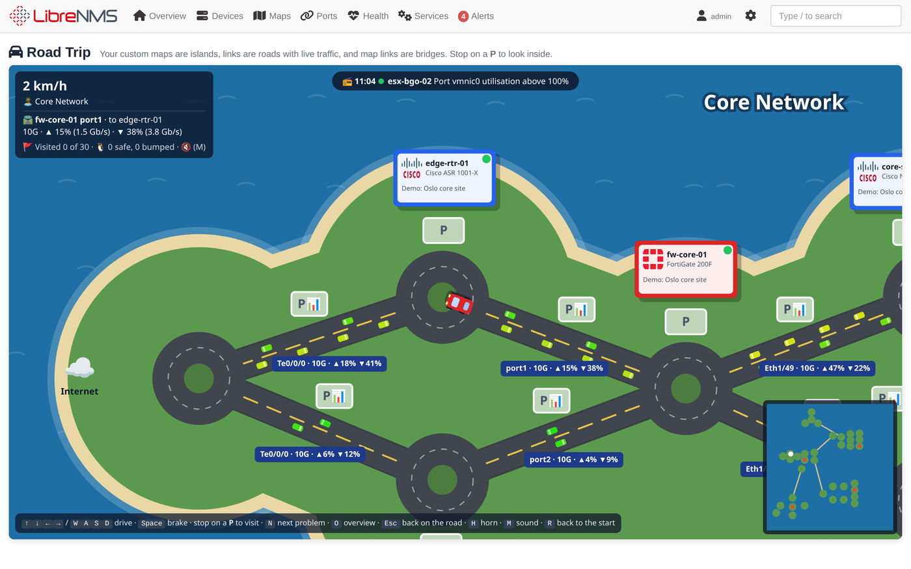

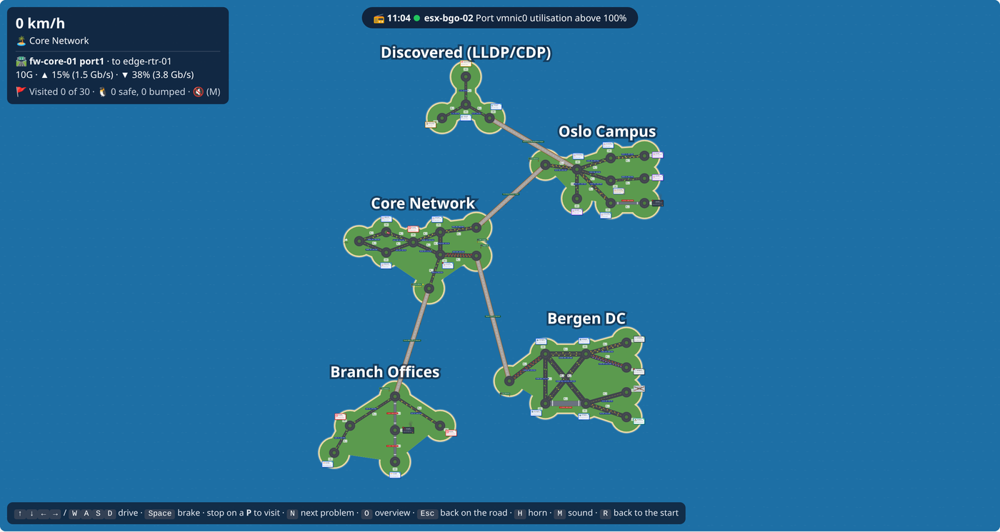

## How it works

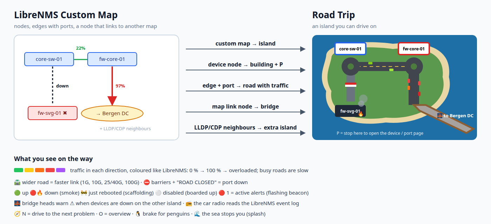

| LibreNMS | In the game |
|---|---|
| **Custom map** (Maps → Custom Maps) | An **island**. The nodes stay where you placed them on the map, so the island looks like your map. |
| **Node with a device** | A **roundabout** with the device's **building** next to it: vendor logo, hardware, location, and a **P** to park on. |
| **Edge with a port** | A **road**. Wider for faster links (1G, 10G, 25/40G, 100G). Little cars drive in each direction, **more and slower the busier the port**, coloured like LibreNMS's custom map legend (green → yellow → orange → red → purple above 100 %). Busy roads (≥ 75 %) slow you down, and at ≥ 90 % there is a traffic jam. |
| **Port down** | Barriers and a red **ROAD CLOSED** sign. |
| **Node that links to another map** | A **bridge** over the sea to that island. The bridge head shows a flashing ⚠ when devices are down on the other side, the same rule LibreNMS uses to colour that node. |
| **LLDP/CDP neighbours** that are on no custom map | An extra island, **Discovered (LLDP/CDP)**, laid out automatically, with bridges to where its neighbours live. |
| **Device status** | 🟢 up · 🔴 **down: dark building with smoke and fire** · 🚧 **just rebooted** (uptime below LibreNMS's `uptime_warning`): scaffolding · ⚪ **disabled**: boarded up |
| **Active alerts** | A flashing red beacon with the number of alerts. |
| **Event log** | The **car radio** 📻 reads the latest events, coloured by severity. |

Traffic, status and the radio are refreshed every minute while you drive.

<table>
  <tr>
    <td width="50%">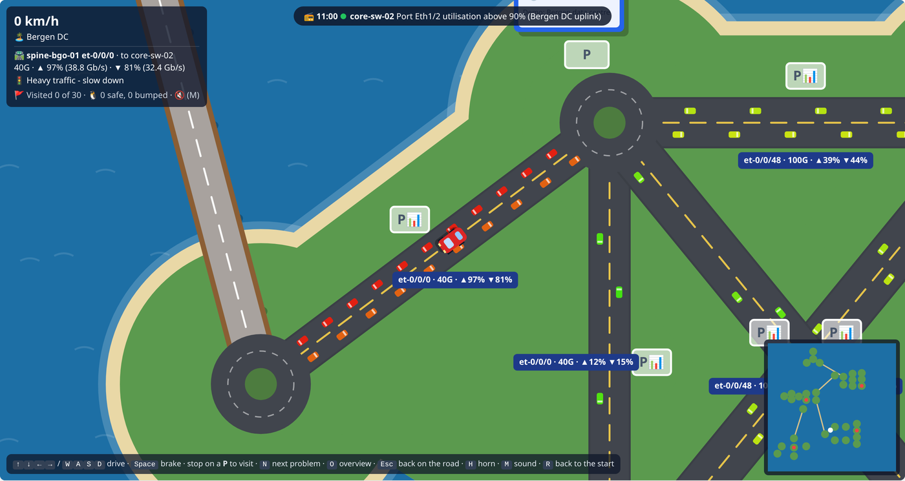</td>
    <td width="50%">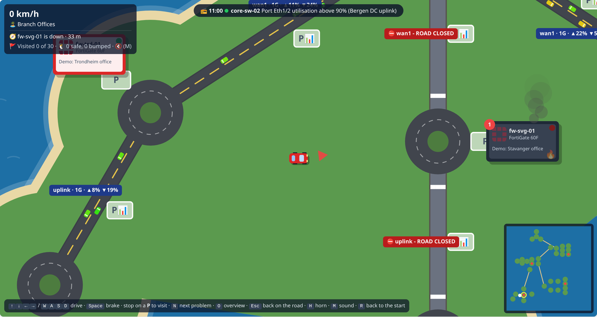</td>
  </tr>
  <tr>
    <td>Traffic jam: the Bergen DC uplink at 97 % / 81 %</td>
    <td>Problems: a down firewall smoking, closed roads, and the 🧭 compass (N)</td>
  </tr>
  <tr>
    <td width="50%">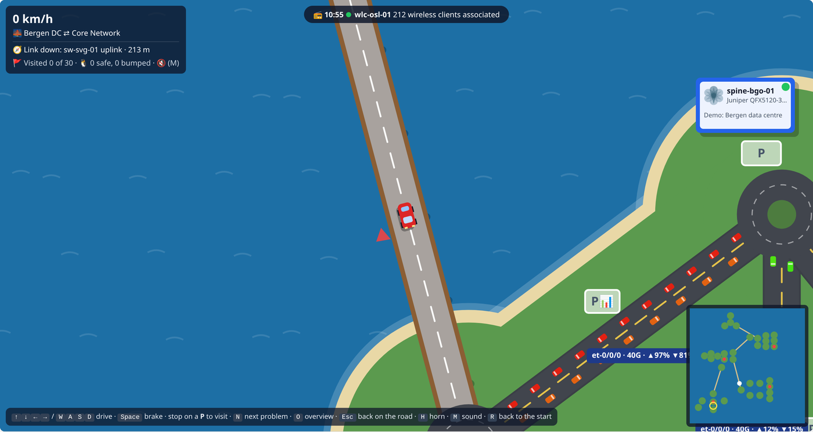</td>
    <td width="50%">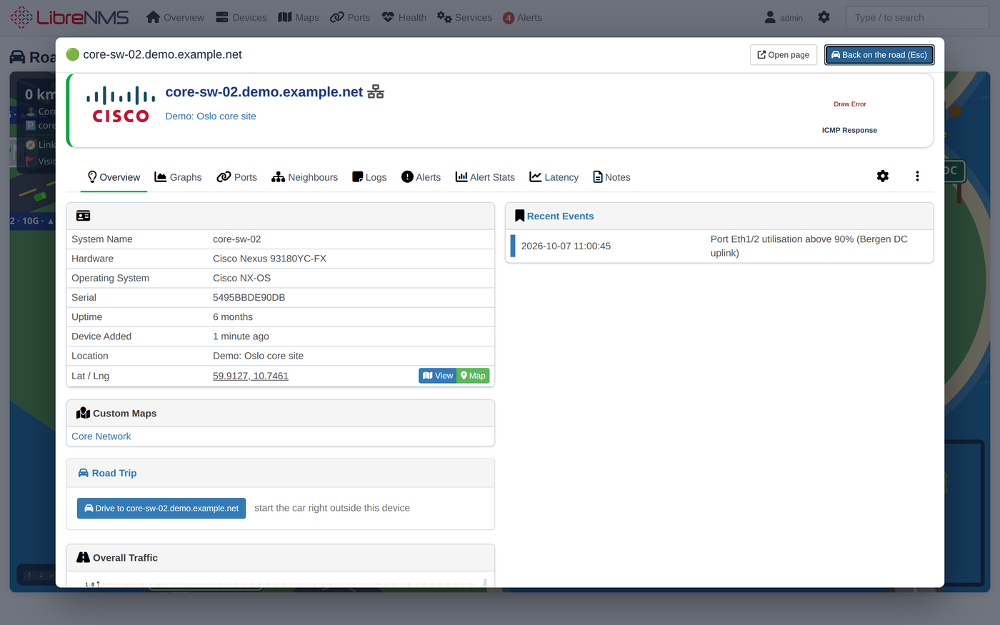</td>
  </tr>
  <tr>
    <td>Bridges join the islands (custom maps that link to each other)</td>
    <td>Park on the P: the device's LibreNMS page opens</td>
  </tr>
</table>

### The jump ramp

The game finds open sea next to an island (the middle one if it has room) and builds a **peninsula** with a run-up
and a ramp at its root, pointing back across the island. Drive out to the tip (or press **J**), turn round, and
race up the ramp: the car soars over the island and lands on the far side, in a sky full of your **IPv4 networks**
flying around like birds (only networks on ports you may see).

<table>
  <tr>
    <td width="50%">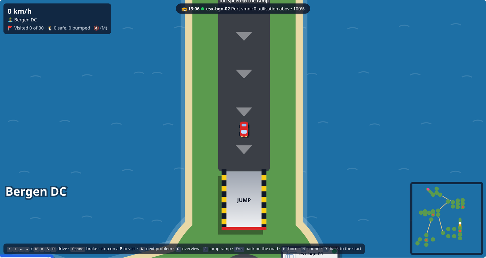</td>
    <td width="50%">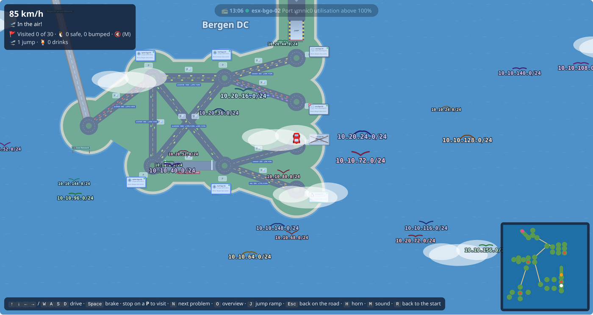</td>
  </tr>
  <tr><td>The run-up on its peninsula - full speed to the ramp</td><td>Over the island, among your IPv4 networks</td></tr>
</table>

### Pubs

**Every 5th island** - in the order the custom maps were created, the LLDP island last - gets a **pub**, each with
its own theme: *The Packet Loss Pub* (Tudor), *Bar Ping* (neon cocktails), *The Tiki TTL* (tiki bar), *O'Router's
Irish Pub*, then round again. It stands at the end of a **small, windy gravel road** on its own peninsula, right by
the beach. Gravel is slower than asphalt.

Park outside and a pixel-art scene plays: a guy walks in and orders a *Singapore Ping*, a *Mai Ping*, a *Ping and
Tonic*, a *Penguin Sunrise*... drinks it, and the window closes. When he gets back into the car, a **police car**
comes down the gravel road with siren and flashing lights - no driving like that: **10 seconds to sober up**, then the
police drive off again. Esc skips the scene (not the wait).

<table>
  <tr>
    <td width="50%">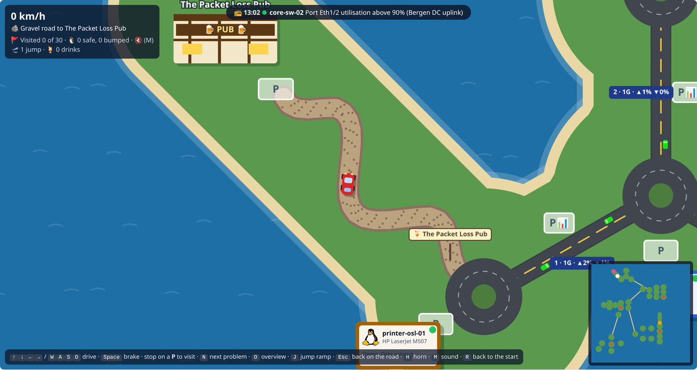</td>
    <td width="50%">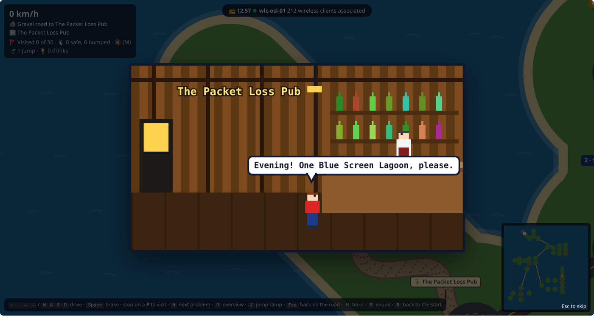</td>
  </tr>
  <tr><td>The gravel road to <i>The Packet Loss Pub</i></td><td>"Evening! One Bloody Ping, please."</td></tr>
  <tr>
    <td width="50%">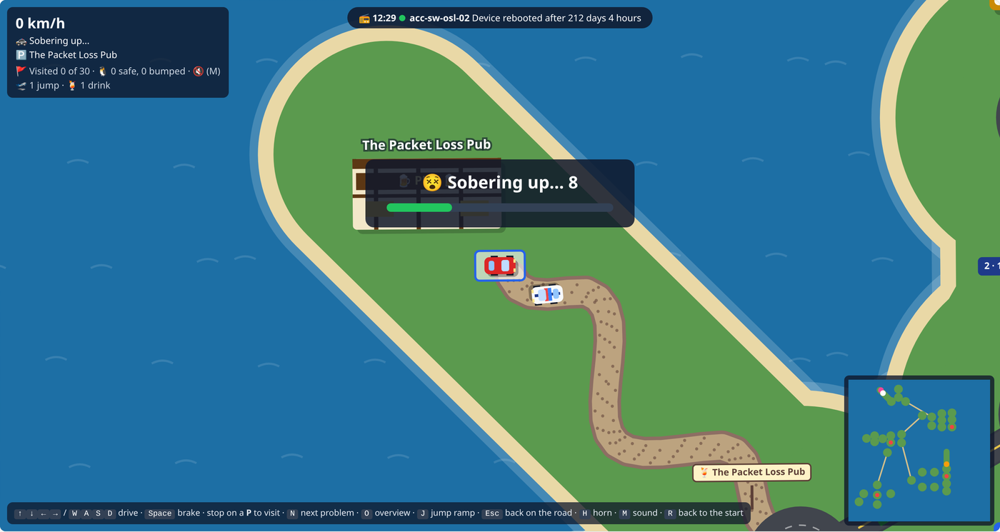</td>
    <td></td>
  </tr>
  <tr><td>...and then the police: 10 seconds to sober up</td><td></td></tr>
</table>

### Driving

| Key | |
|---|---|
| ↑ ↓ ← → or W A S D | Drive |
| Space | Brake |
| **N** | **Next problem**: a compass arrow points to the next down device, alert, closed road or traffic jam (press again for the one after) |
| **O** | Overview: the whole archipelago from above |
| **J** | To the tip of the jump ramp's run-up, facing the ramp |
| Esc | Back on the road (closes a device or port page) |
| H / M / R | Horn / sound on or off / back to the start |

- Stop on a **P** in front of a building to open the device's page, or on a **P📊** next to a road to open the port's
  page (with its graphs) - *Open page* takes you there for real. Visited buildings get a 🚩.
- The sea stops you, with a splash. Grass is slow, roads and roundabouts are fast.
- Sometimes a 🐧 **penguin** waddles across the road. Brake! Hit it and you spin out (the penguin is fine).
- Sound is generated in the browser (engine, horn, waves on the bridges, the radio, wind in the air, the pub); **M**
  mutes it.

### In LibreNMS

The game is under **Overview → Plugins → Road Trip** (`/plugin/roadtrip`). Every device's overview page gets a
small **Road Trip** box that starts the car right outside that device:

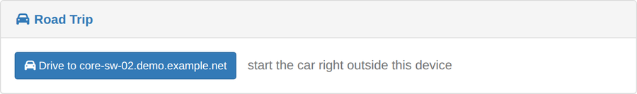

This is the same Core Network custom map in LibreNMS - the island above is built from it:

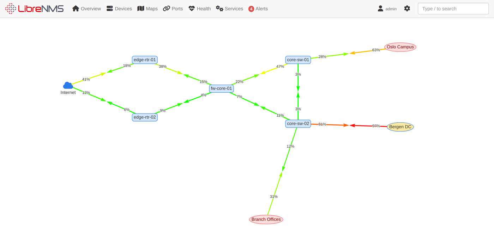

## Requirements

- LibreNMS with **plugin packages** and **custom maps** - developed on **26.9.1** (custom maps with map links exist
  since 24.x).
- Islands come from the custom maps a user may view (LibreNMS's own rule: read access to every device on the map)
  and from LLDP/CDP links between devices the user may see. Users who can see neither get a friendly empty sea.
- A browser with canvas and Web Audio (any current one).

## Installation

The plugin is a Composer package (`vinceneil666/librenms-roadtrip`). The repository is private for now, so install
it from a checkout:

```bash
git clone git@github.com:vinceneil666/librenms-roadtrip.git /opt/librenms-roadtrip
sudo -u librenms sh /opt/librenms-roadtrip/dev/install-dev.sh
```

`dev/install-dev.sh` adds the checkout as a Composer path repository (symlinked), runs
`lnms plugin:add vinceneil666/librenms-roadtrip @dev` and clears LibreNMS's caches. The plugin enables itself; it is
listed under **Overview → Plugins → Plugin Admin**.

> **Docker** (`librenms/librenms`): mount the checkout into the container (e.g. at `/opt/librenms-roadtrip`) and run
> the script inside it as the `librenms` user. Composer changes live in the container, so run it again after the
> container is re-created.

### Settings

Under **Plugin Admin → Road Trip** (defaults shown):

| Setting | Default | |
|---|---|---|
| `discovered_island` | `true` | Build the extra island from LLDP/CDP neighbours that are on no custom map |
| `max_discovered` | `150` | At most this many devices on that island |
| `radio_events` | `25` | Event log entries on the car radio |
| `max_networks` | `150` | At most this many IPv4 networks (on ports the user may see) fly around as birds during a jump |

## Trying it with demo data

`dev/seed-demo.php` creates a made-up network on a **test** LibreNMS (never on a production one): 30 devices
(`*.demo.example.net`), 64 ports with traffic rates, LLDP links, four custom maps that link to each other (Core
Network ↔ Oslo Campus, Bergen DC, Branch Offices), a few unmapped LLDP neighbours, down / disabled / rebooted
devices, a down link, an overloaded link, alerts and event log entries. Running it again replaces the demo data.

```bash
lnms tinker --execute="require '/opt/librenms-roadtrip/dev/seed-demo.php';"
```

All screenshots here were made with it, on a LibreNMS without a poller (so the numbers stay as seeded - and the
port graphs say *No Data*).

## How it is built

| File | |
|---|---|
| `src/RoadTripProvider.php` | Registers the hooks (menu entry, device overview box, settings), routes and views |
| `src/World.php` | Collects the world for one user: custom maps (with `can('view')`), nodes, edges with port traffic (the same rate / speed maths as LibreNMS's custom map), LLDP neighbours, alerts, event log |
| `src/Http/RoadTripController.php` | `GET /plugin/roadtrip` (the game) and `GET /plugin/roadtrip/world` (JSON, polled every minute) |
| `resources/views/game.blade.php` | The game: plain JavaScript on a `<canvas>`, no libraries - island placement (the island with most bridges in the middle, the others in the direction their bridges point), roads, traffic, buildings, physics, sound |
| `dev/` | Demo data and the development installer |

Nothing is written to LibreNMS; the only state is in the browser (visited buildings, sound on/off).

## Ideas for later

Port graphs on billboards along the roads, health sensors (hot devices shimmer), services as shops, BGP peers as
ferries to other countries, wireless clients walking around access points, islands placed by location GPS.

## Changelog

### 0.2.0 (2026-10-07)

- **Jump ramp** on a new peninsula (the middle island if it has room), pointing back across the island; the flight is
  aimed at dry land, IPv4 networks of ports you may see fly around as birds (`max_networks`). **J** goes to the ramp.
- **Pubs** on every 5th island (creation order), themed Tudor / neon / tiki / Irish, at the end of a windy gravel road
  on their own peninsula by the beach; pixel-art drink scene, then the police come down the gravel road and you sober
  up for 10 seconds.
- New sounds (launch, wind, landing, tweets, door bell, chatter, pour, glug, hic, siren, whistle); drinks and jumps in
  the corner. Demo data now has IPv4 addresses.

### 0.1.0 (2026-10-07, first version)

First version: custom maps as islands, edges as roads with live port traffic and jams, map links and LLDP
neighbours as bridges, device status (down / rebooted / disabled / alerts), visits to device and port pages,
next-problem compass, overview, car radio from the event log, penguins, sound, device overview box, demo data.

## License

Apache License 2.0, see [LICENSE](LICENSE).
